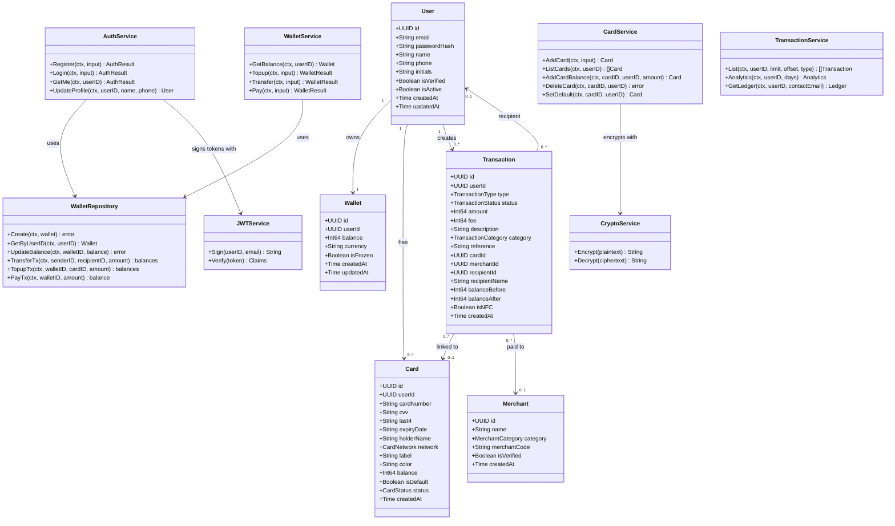
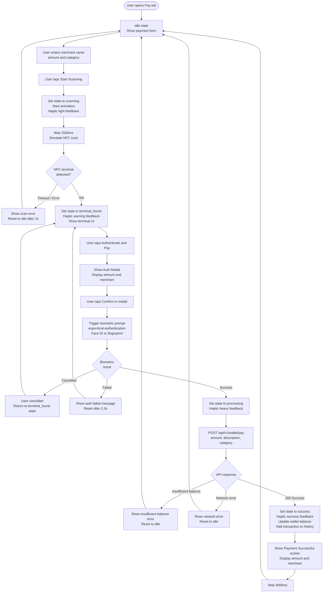
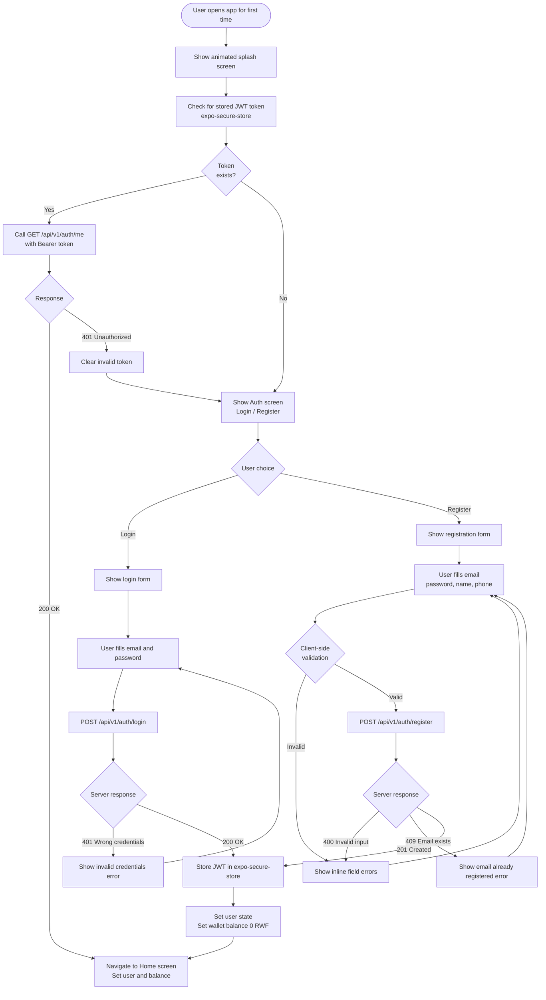
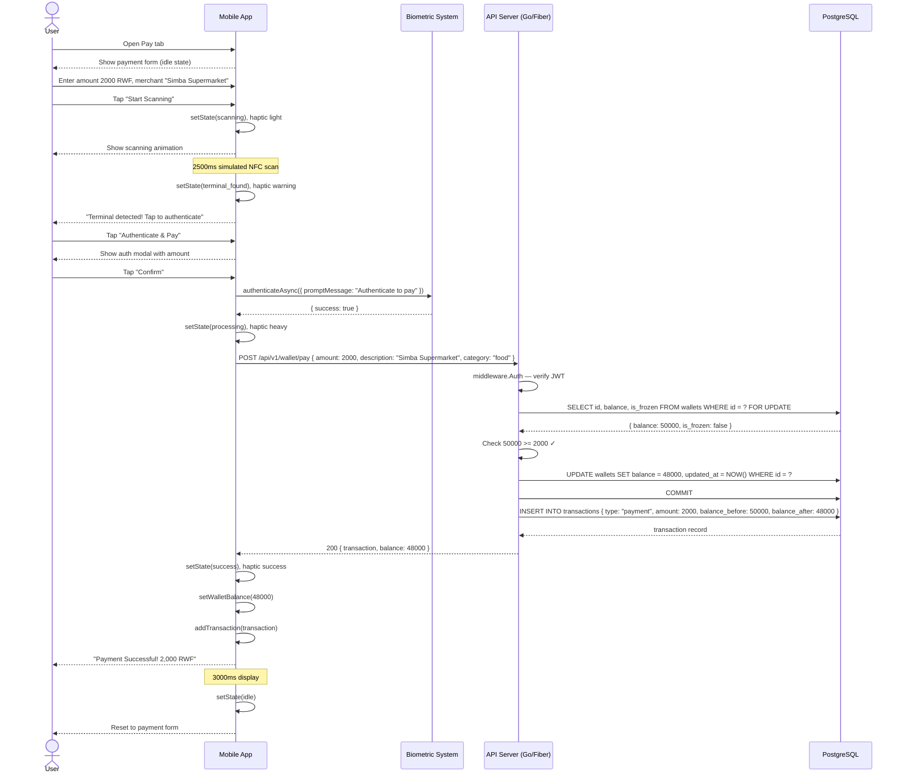
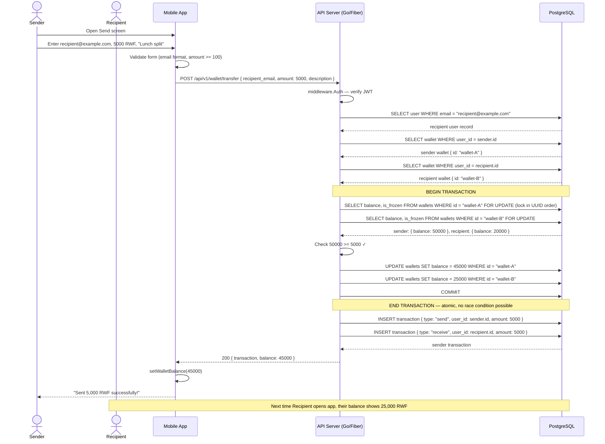
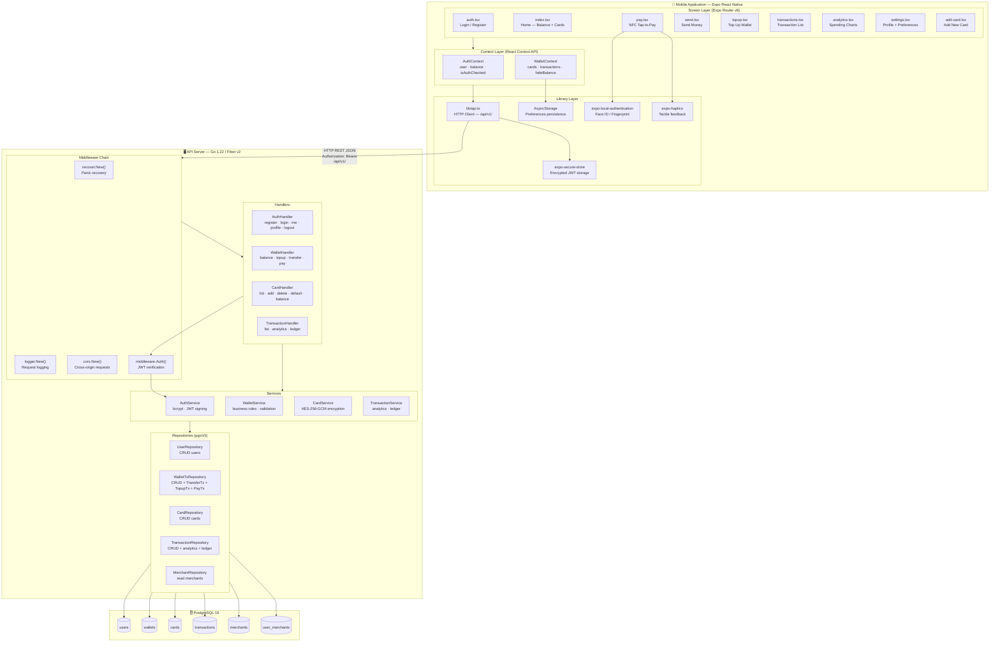

# Phase 1 — UML Diagrams

All diagrams are written in Mermaid syntax. They can be rendered in:
- GitHub (native Mermaid support in `.md` files)
- VS Code with the "Mermaid Preview" extension
- [mermaid.live](https://mermaid.live) — paste any diagram block to render it

---

## 1. Use Case Diagram

```mermaid
graph TD
    subgraph Actors
        G([Guest User])
        U([Authenticated User])
        B([Biometric Device\nFace ID / Fingerprint])
        API([API Server])
    end

    subgraph Authentication
        UC1[Register Account]
        UC2[Login with Email]
        UC4[Restore Session on Launch]
        UC5[Update Profile]
        UC6[Logout]
    end

    subgraph Wallet Operations
        UC7[View Wallet Balance]
        UC8[Top Up Wallet from Card]
        UC9[Transfer Money by Email]
        UC10[NFC Tap-to-Pay]
        UC11[Biometric Authentication]
    end

    subgraph Card Management
        UC12[View Cards]
        UC13[Add New Card]
        UC14[Delete Card]
        UC15[Set Default Card]
        UC16[Add Balance to Card]
    end

    subgraph Transactions
        UC17[View Transaction History]
        UC18[Filter Transactions by Type]
        UC19[View Spending Analytics]
        UC20[View Contact Ledger]
    end

    subgraph Settings
        UC21[Toggle Hide Balance]
        UC22[Toggle Face ID for Payments]
    end

    G --> UC1
    G --> UC2

    U --> UC4
    U --> UC5
    U --> UC6
    U --> UC7
    U --> UC8
    U --> UC9
    U --> UC10
    U --> UC12
    U --> UC13
    U --> UC14
    U --> UC15
    U --> UC16
    U --> UC17
    U --> UC18
    U --> UC19
    U --> UC20
    U --> UC21
    U --> UC22

    UC10 --> UC11
    UC11 --> B

    UC1 --> API
    UC2 --> API
    UC8 --> API
    UC9 --> API
    UC10 --> API
    UC17 --> API
    UC19 --> API
```

---

## 2. Class Diagram

---

## 3. Activity Diagram — NFC Tap-to-Pay Flow

---

## 4. Activity Diagram — User Registration and Onboarding

---

## 5. Sequence Diagram — Complete NFC Payment

---

## 6. Sequence Diagram — Wallet Transfer (Atomic)

---

## 7. Component Diagram

