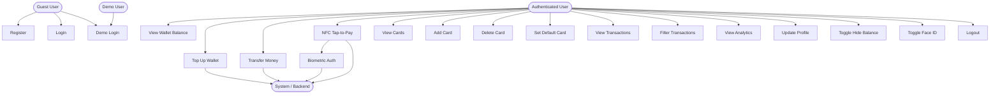
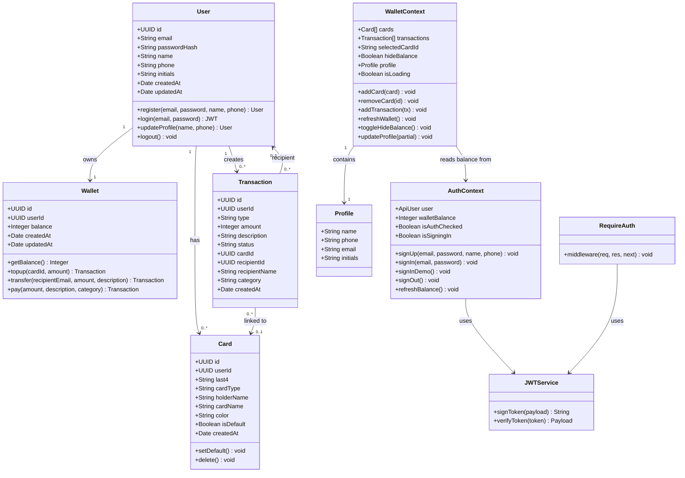
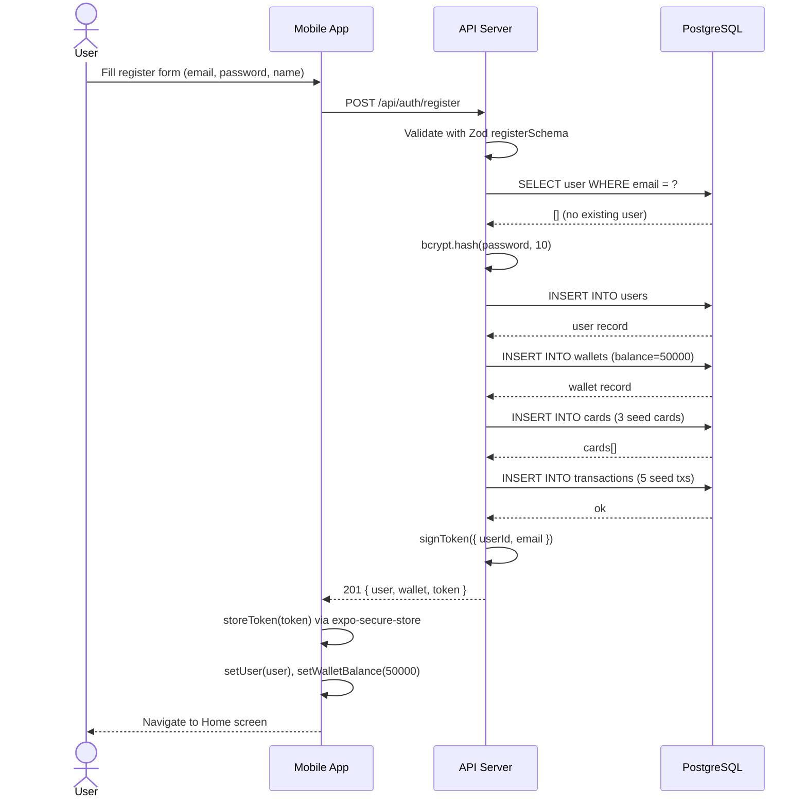
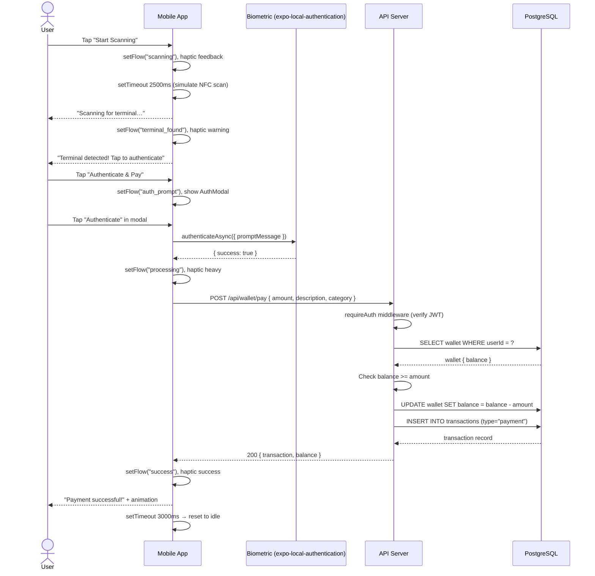
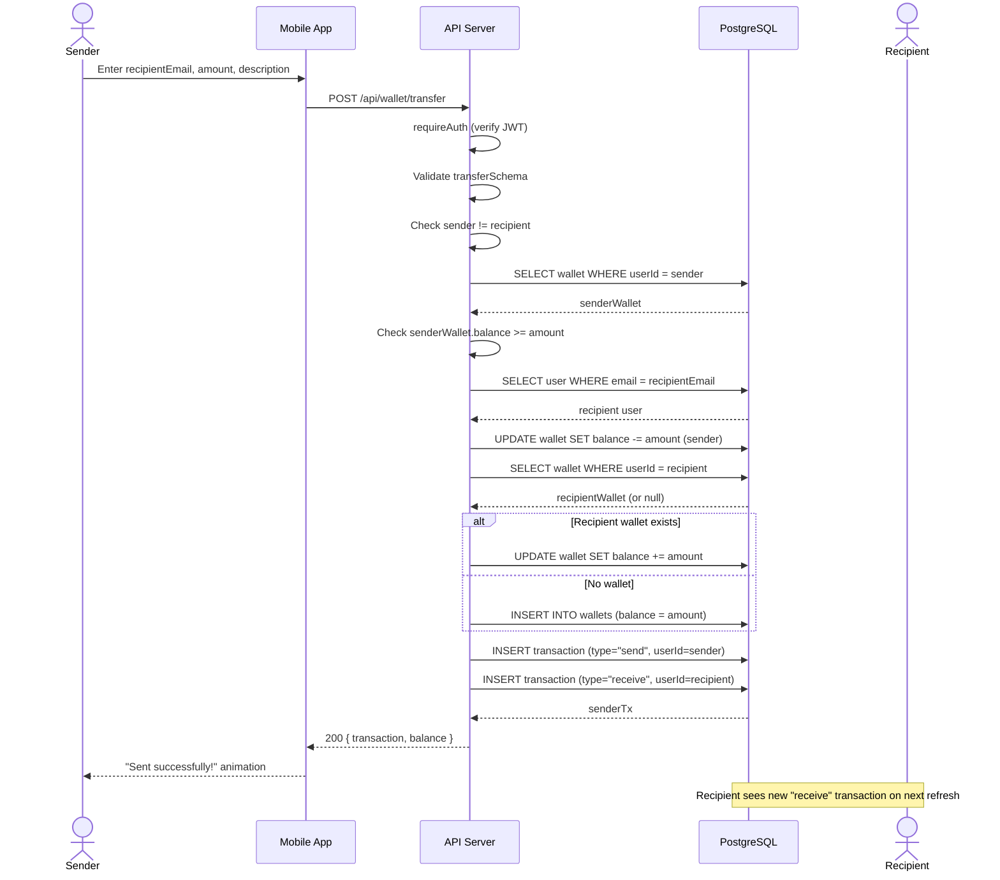
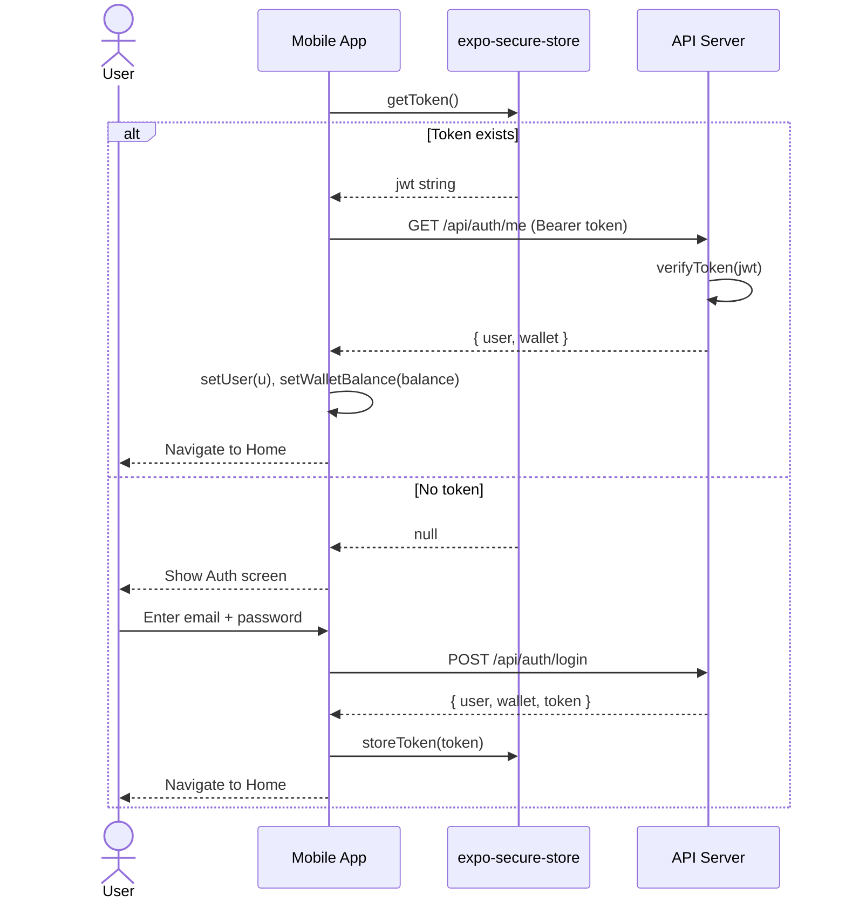
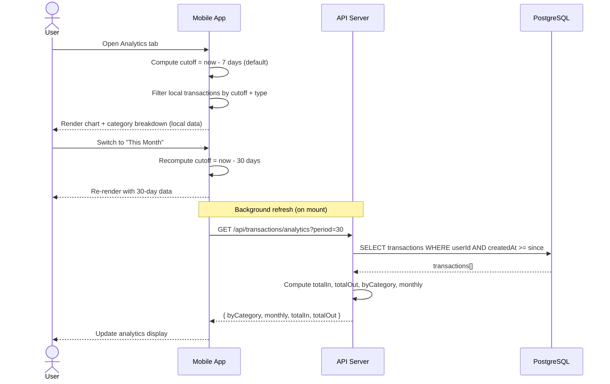

# Rwanda Pay — UML Diagrams

---

## 1. Use Case Diagram

---

## 2. Class Diagram

---

## 3. Sequence Diagram — User Registration

---

## 4. Sequence Diagram — NFC Tap-to-Pay

---

## 5. Sequence Diagram — Wallet Transfer

---

## 6. Sequence Diagram — Login & Token Restore

---

## 7. Sequence Diagram — Analytics

