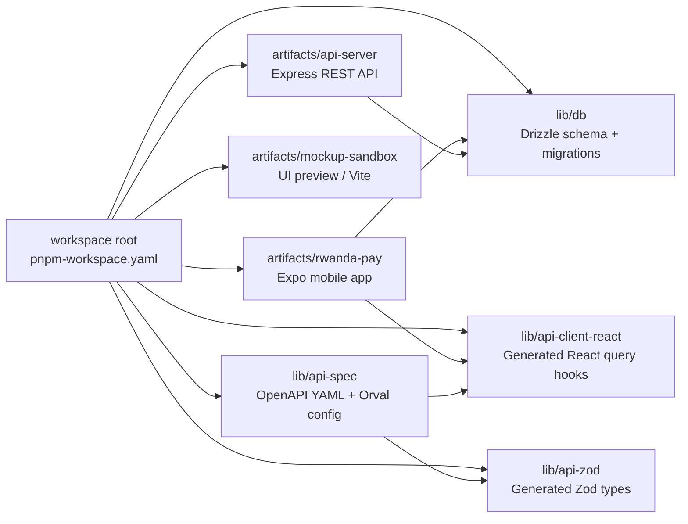
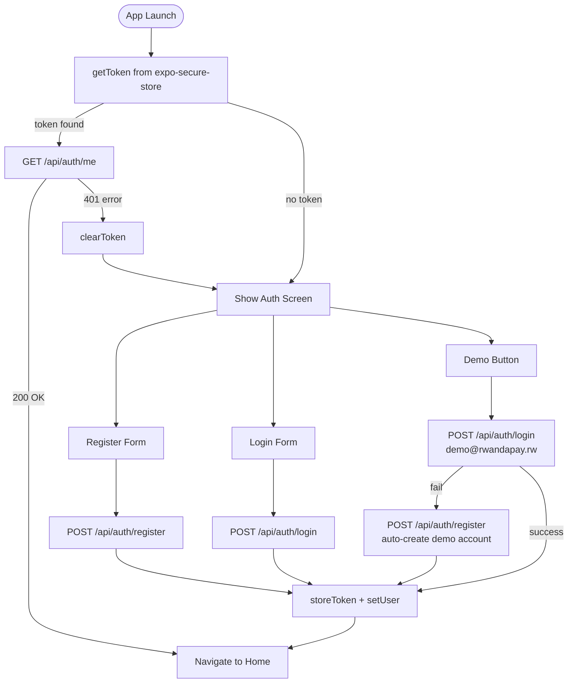
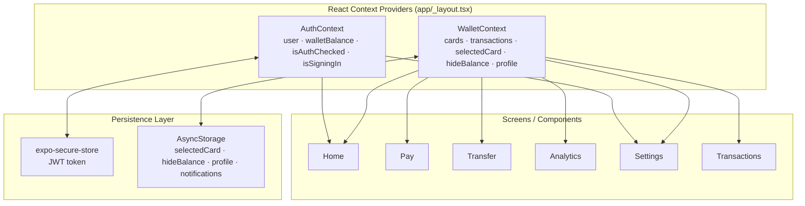
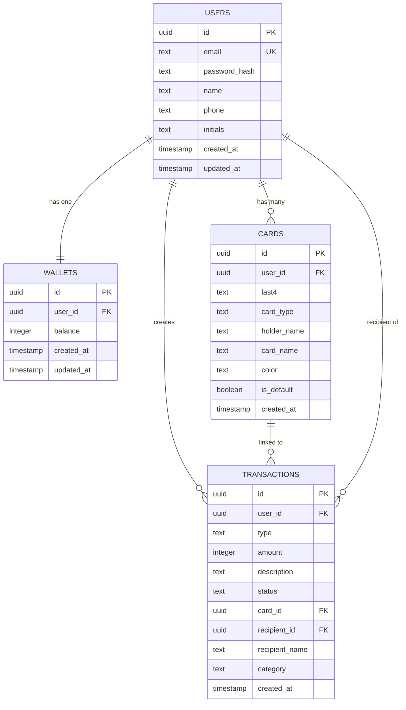
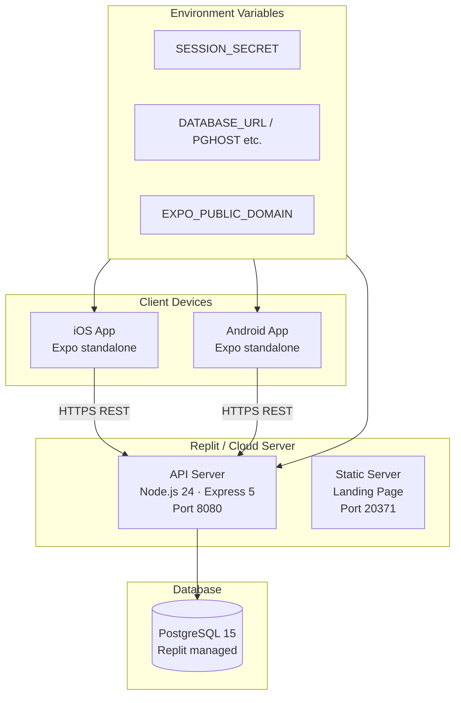

# Rwanda Pay — System Design

---

## 1. High-Level Architecture

```mermaid
graph TB
    subgraph Mobile["Mobile App (Expo / React Native)"]
        UI[Screen Layer<br/>Expo Router v6]
        CTX[Context Layer<br/>AuthContext / WalletContext]
        LIB[API Client<br/>lib/api.ts]
    end

    subgraph Backend["API Server (Node.js / Express 5)"]
        MW[Middleware<br/>CORS · pino-http · requireAuth]
        RT[Route Handlers<br/>auth · wallet · cards · transactions]
        SVC[Services<br/>JWT · bcrypt · Drizzle ORM]
    end

    subgraph Data["Data Layer"]
        PG[(PostgreSQL<br/>users · wallets · cards · transactions)]
    end

    subgraph Shared["Shared Libraries (pnpm workspace)"]
        SCHEMA[@workspace/db<br/>Drizzle schema + Zod validators]
        APICLIENT[@workspace/api-client-react<br/>Generated React hooks]
        APIZOD[@workspace/api-zod<br/>Zod types from OpenAPI]
    end

    UI --> CTX
    CTX --> LIB
    LIB -->|HTTP REST JSON| MW
    MW --> RT
    RT --> SVC
    SVC --> PG
    SVC --> SCHEMA
    RT --> SCHEMA
    LIB --> APICLIENT
    APICLIENT --> APIZOD
```

---

## 2. Monorepo Package Structure



---

## 3. Mobile App — Screen & Navigation Structure

```mermaid
graph TD
    ROOT_LAYOUT[_layout.tsx<br/>AuthProvider + WalletProvider + SplashOverlay]

    ROOT_LAYOUT --> AUTH[/auth<br/>Sign In / Sign Up / Demo]
    ROOT_LAYOUT --> TABS[(tabs) _layout.tsx<br/>Bottom Tab Navigator]

    TABS --> HOME[index.tsx<br/>Home — Balance + Cards + Quick Actions]
    TABS --> PAY[pay.tsx<br/>NFC Tap-to-Pay]
    TABS --> TRANSFER[transfer.tsx<br/>Send / Receive]
    TABS --> ANALYTICS[analytics.tsx<br/>Spending Charts]
    TABS --> SETTINGS[settings.tsx<br/>Profile + Preferences]
    TABS --> TRANSACTIONS[transactions.tsx<br/>Transaction List]

    ROOT_LAYOUT --> SEND[/send<br/>Send Money modal]
    ROOT_LAYOUT --> RECEIVE[/receive<br/>Receive / QR Code]
    ROOT_LAYOUT --> TOPUP[/topup<br/>Top Up Wallet]
    ROOT_LAYOUT --> ADDCARD[/add-card<br/>Add New Card]
    ROOT_LAYOUT --> TXFULL[/transactions-full<br/>Full Transaction History]
    ROOT_LAYOUT --> ANFULL[/analytics-full<br/>Full Analytics]
```

---

## 4. API Server — Request Lifecycle

```mermaid
flowchart LR
    REQ[HTTP Request] --> CORS[CORS Middleware]
    CORS --> LOG[pino-http Logger]
    LOG --> BODY[express.json Parser]
    BODY --> ROUTER[/api Router]

    ROUTER --> AUTH_RT[/auth routes<br/>register · login · me · profile · logout]
    ROUTER --> WALLET_RT[/wallet routes<br/>GET · topup · transfer · pay]
    ROUTER --> CARDS_RT[/cards routes<br/>list · add · delete · set-default]
    ROUTER --> TX_RT[/transactions routes<br/>list · analytics]
    ROUTER --> HEALTH[/healthz]

    AUTH_RT --> REQUIRE{requireAuth?}
    WALLET_RT --> REQUIRE
    CARDS_RT --> REQUIRE
    TX_RT --> REQUIRE

    REQUIRE -->|valid JWT| DB[(PostgreSQL<br/>via Drizzle ORM)]
    REQUIRE -->|invalid| ERR401[401 Unauthorized]
    DB --> RES[JSON Response]
```

---

## 5. Authentication Flow



---

## 6. Data Flow — Wallet Top-Up

```mermaid
flowchart LR
    USER([User]) -->|selects card + amount| TOPUP_SCREEN[TopUp Screen]
    TOPUP_SCREEN -->|POST /api/wallet/topup| API[API Server]
    API -->|validate cardId ownership| CARDS_DB[(cards table)]
    CARDS_DB --> API
    API -->|read current balance| WALLET_DB[(wallets table)]
    WALLET_DB --> API
    API -->|UPDATE balance += amount| WALLET_DB
    API -->|INSERT transaction type=topup| TX_DB[(transactions table)]
    TX_DB --> API
    API -->|{ transaction, balance }| TOPUP_SCREEN
    TOPUP_SCREEN -->|setWalletBalance| AUTH_CTX[AuthContext]
    AUTH_CTX --> HOME[Home Screen re-renders balance]
```

---

## 7. State Management Architecture



---

## 8. Database Entity Relationship Diagram



---

## 9. Deployment Architecture


