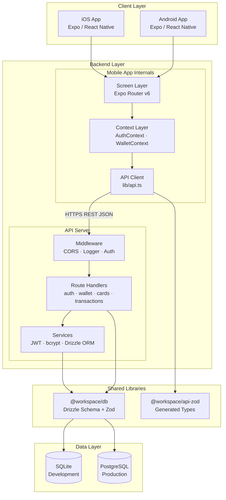
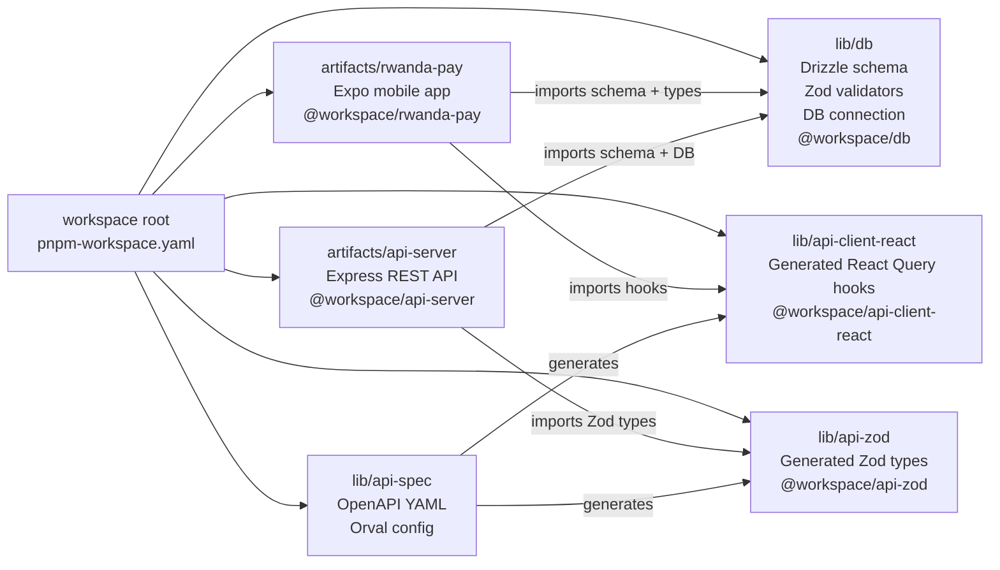
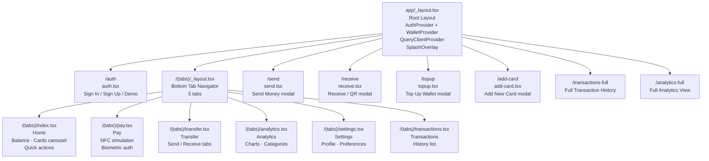
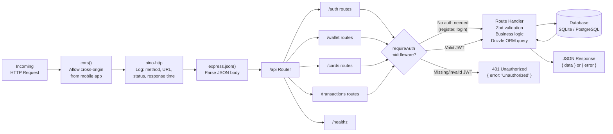
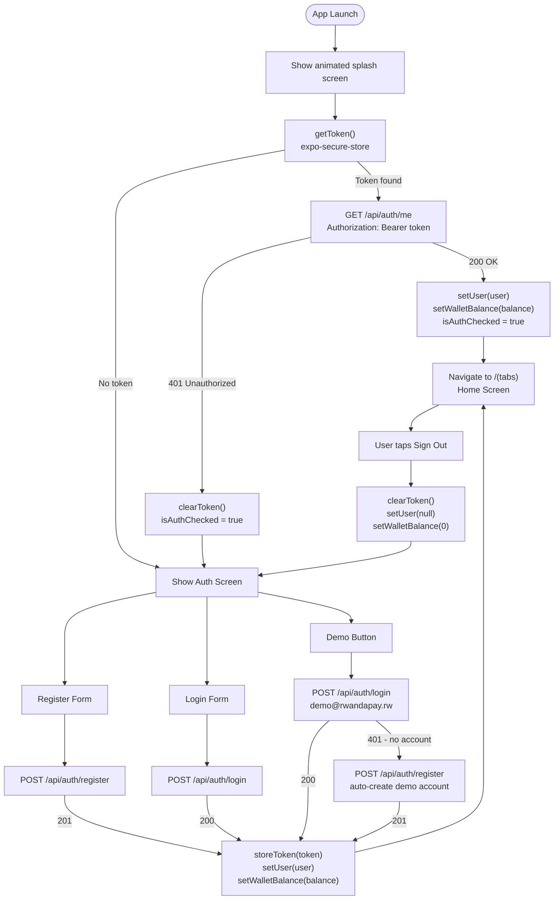
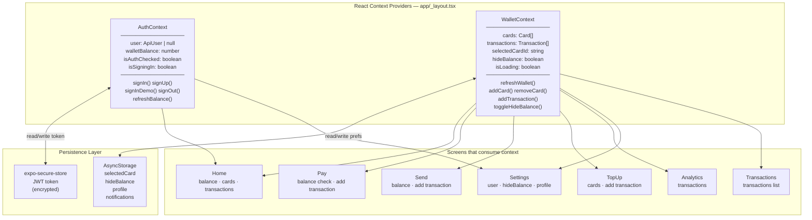
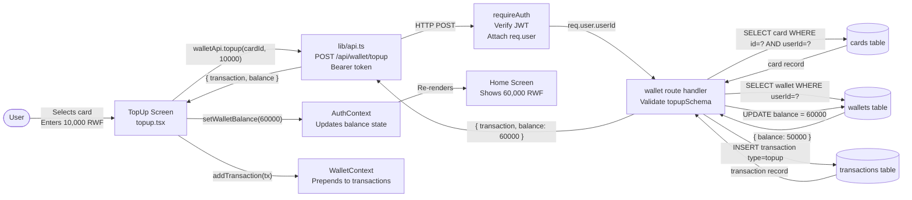
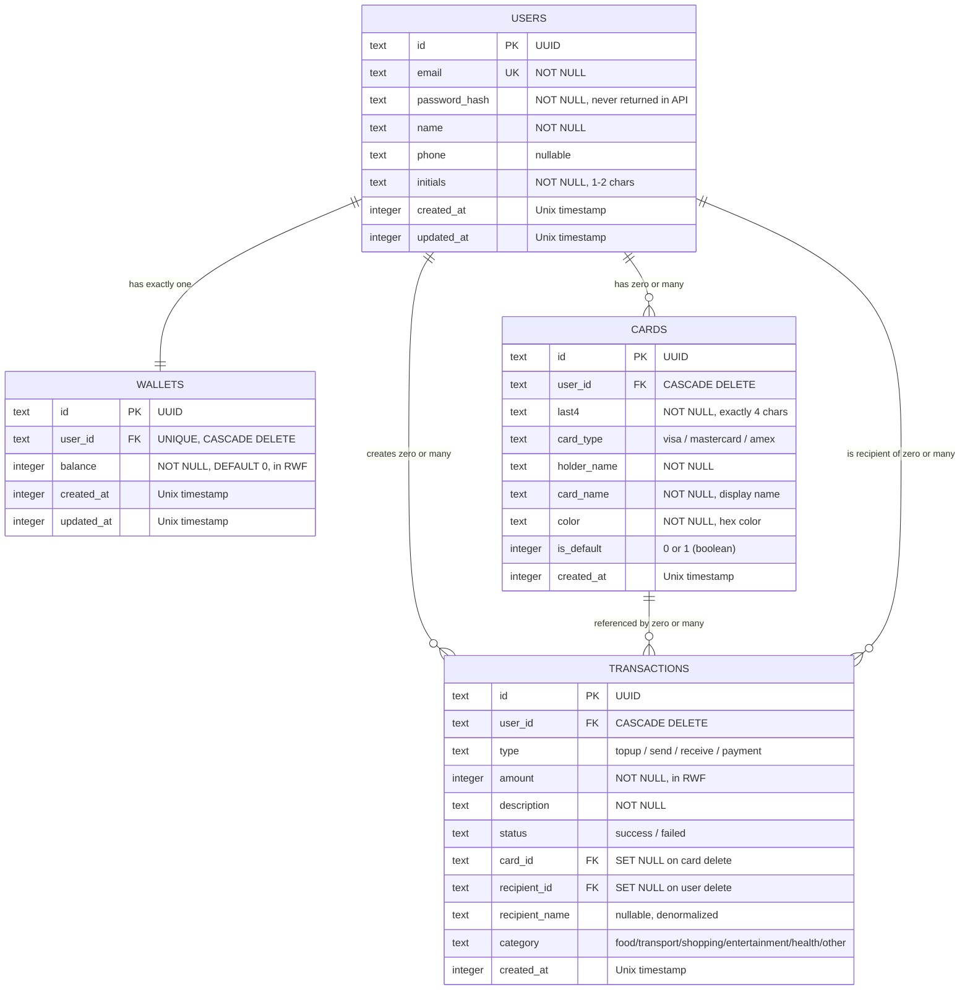
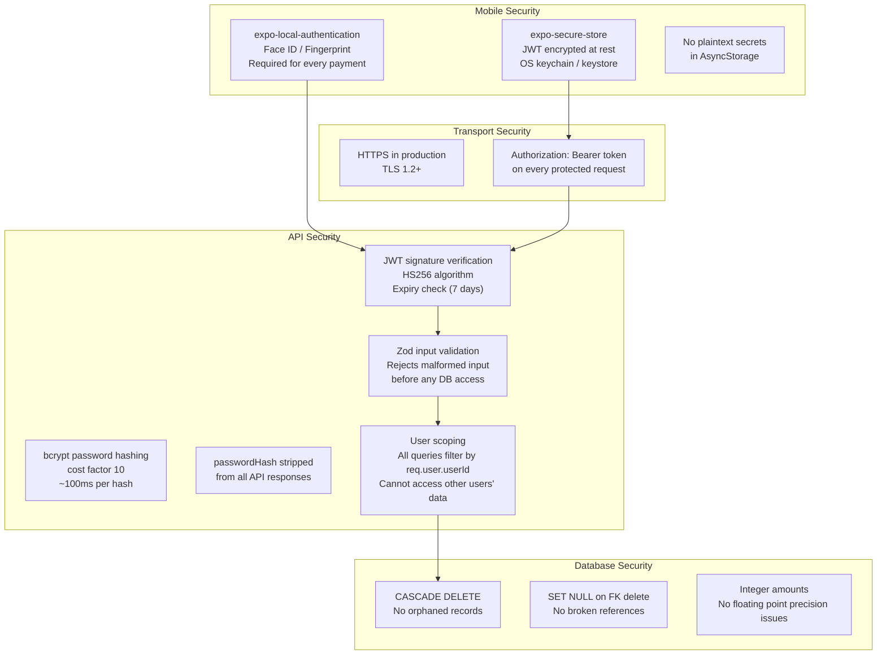
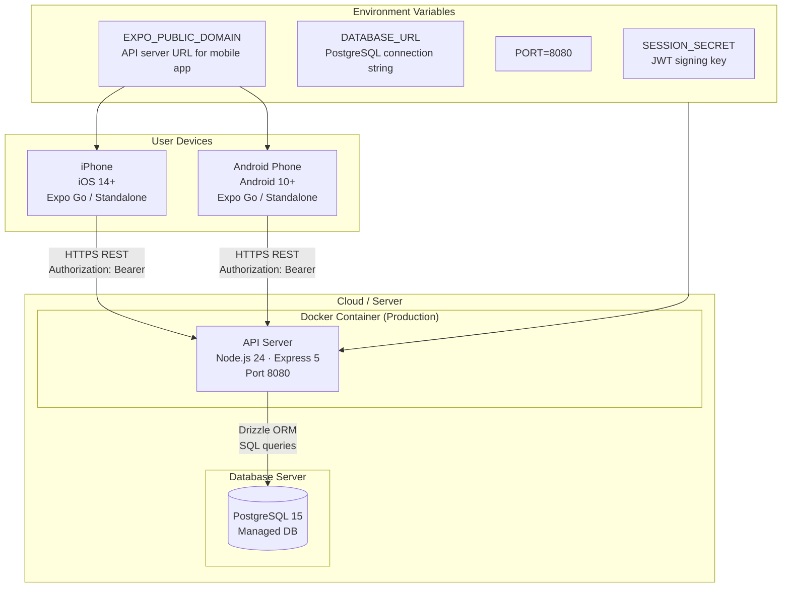

# Phase 1 — System Design

---

## 1. High-Level Architecture

Rwanda Pay follows a **client-server architecture** with a clear separation between the mobile frontend, the REST API backend, and the data layer. All three layers communicate through well-defined interfaces.

---

## 2. Monorepo Package Structure

Rwanda Pay uses a **pnpm monorepo** to share code between the mobile app and the API server without duplication.

**Why a monorepo?**
- The database schema (`lib/db`) is shared between the API server and the mobile app — no duplication of type definitions
- Zod validators defined once in `lib/db` are used for both API validation and client-side type checking
- Changes to the schema automatically propagate to both the backend and frontend via TypeScript compilation

---

## 3. Mobile App — Screen and Navigation Structure

Rwanda Pay uses **Expo Router v6** for file-based navigation. The file structure directly maps to the URL/route structure.

---

## 4. API Server — Request Lifecycle

Every HTTP request to the API server passes through a defined middleware chain before reaching the route handler.

---

## 5. Authentication and Session Management Flow

---

## 6. State Management Architecture

Rwanda Pay uses **React Context API** for global state management. There are two providers: `AuthContext` for user identity and `WalletContext` for financial data.

---

## 7. Data Flow — Wallet Top-Up

A detailed trace of data through all layers for the top-up operation.

---

## 8. Database Entity Relationship Diagram

---

## 9. Security Architecture

---

## 10. Deployment Architecture

